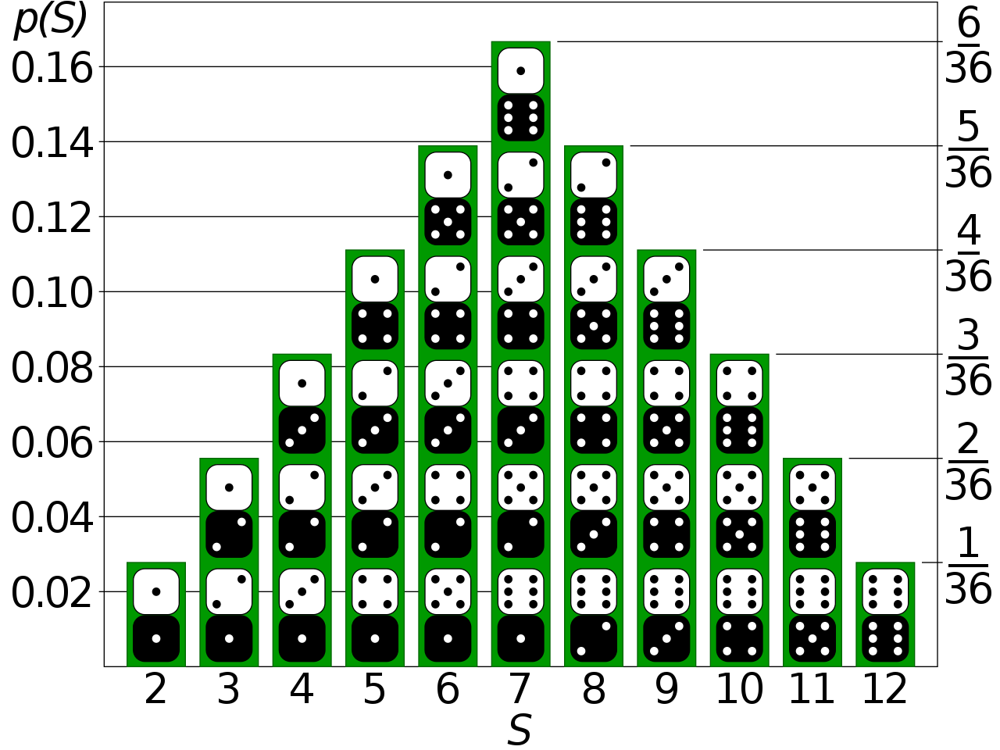
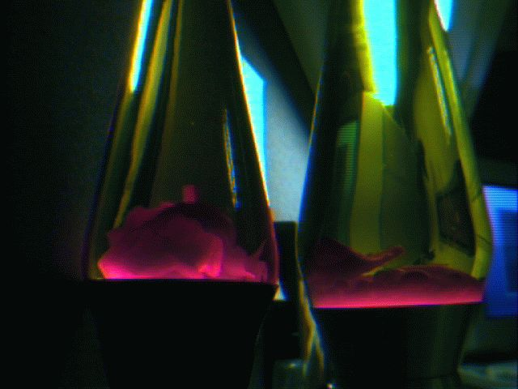
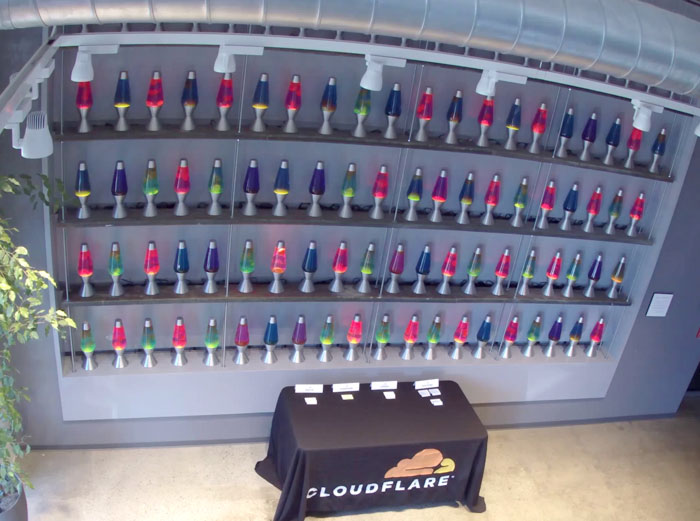
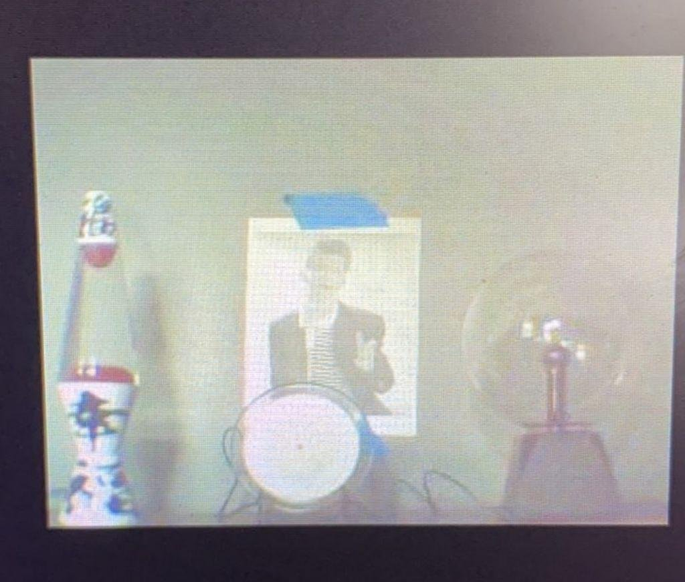

% STL2600 + DC314: Lava Lamp RNG
% https://github.com/STL2600/Webcam-RNG

# Randomness

Defined as "Randomness is the apparent or actual lack of pattern or predictability in events."

## Different Kinds of Randomness

- "True" Random
- Statistically Random
- Pseudo Random
- Cryptographically Random

# "True" Random

Individual random events are unpredictable.

The probability, the likeliness of the outcome, is predictable

## Examples

- Coin Flip
- Dice Roll
- Hardware RNGs

# Statistically Random

A numeric sequence is statistically random when it contains no recognizable patterns or regularities.

## Examples

- Roll of a single die (as oppose to multiple dice)
- Digits of pi

## Statistically Random vs "True" Random

# Pseudo Random

A completely deterministic and repeatable process that produces a sequence of numbers that appeaers to be patternless.

## Examples

- TOTP Passcodes (e.g. Google Auth)
- RANDU
- Mersenne Twister / MT19937
- https://en.wikipedia.org/wiki/List_of_random_number_generators

# CSPRNGs

or "Cryptographically Secure Pseudorandom Number Generators"

For a PRNG to be considered suitable for use with cryptography:

- Must pass the "next-bit test"
- Withstand "State Compromise Extensions"

## Examples

- Cryptographic hashes
- Blum Blum Shub
- ChaCha20 (In modern BSD's and Linux)
- DO NOT USE "Math.Random"!

# Testing Randomness

Randomness is tested by analyzing the distribution of a set of data for patterns.

## Null Hypothesis Significance Testing

Testing the probability of obtaining test results that are at least as extreme as the results that are actually observed.

## Null Hypothesis Significance Testing

How does that work?

1. Pick your statistical test.
2. Determine how unlikely extreme results are to occure.  Usually between 1-5%.  This is our "alpha".
3. Run your tests and collect the results.
4. Observe how often exteme results happen.  This becomes your "p-level"
5. If `p-level < alpha`, then the null hypothesis fails.

## Null Hypothesis Significance Testing

How do we figure all that out?

MATHS!  LOTS OF CONFUSING MATHS!

## Null Hypothesis Significance Testing

- Many statistical tests out there
- Most involve Chi-square or Kalmogorov-Smirnov testing
- Not sure what those are.  Just see those words a lot.
- Usually accomanied by graphs and more confusing maths.

# Dieharder

Due to a lack of collective intelligence, we had someone else do the heavy lifting...

- Dieharder is a testing and benchmarking too for random nubmer generators.
- It provides 30 different tests that you can adjust to your needs.
- 81 sources of randomness to benchmark against.

# Lava Lamps as RNGs

Why use a Lava Lamp?

- They are a good source of entropy when used properly.
- Digital cameras used to capture the images are inherently noisy.

# SGI's Lava Rand

## SGI's Lava Rand

- Originally demonstrated and patented by SGI.
- Ran from 1997 to 2001.
- Anyone could get randomness from it at lavarand.sgi.com

## SGI's Lava Rand

- Requires 6 lava lamps.
  - Lava lamps are only suppose to run for 8-10 hours.
  - 3 are needed to cover a 24 hour period.
  - Another to allow for redundancy.

## SGI's Lava Rand

How it worked:

- Picture was taken with a digital camera.
- Resulting image was hashed with SHA-1.
- The hash is used to seed a PRNG

# Cloudflare's "Wall of Entropy"

One day Cloudflare saw what SGI had done and said "Hold my beer..."

## Cloudflare's "Wall of Entropy"

- Upped the numer of Lava Lamps to 100.
- Each time it's used, it generates 16,384 bits of entropy.

# Weaknesses in a Lava Lamp RNG

- If an attacker can gain a view an point a camera at the lamps, they could attempt to recreate the image.
- Attempt to reduce entropy by attacking power or obstructing the camera's view.
- Compromise the camera that drives the camera and exfiltrate or modify data

## Weaknesses in a Lava Lamp RNG

- Access to the network could allow observation of the entropy feed.
- Redirect any systems using the entropy feed to an alternate source.

# Our Setup

## Hardware

 - Raspberry PI with minimal Arch Linux build
 - Cheap Janky Webcam (TM)
 - Lava Lamp
 - Plasma Ball
 - Plasma Disc
 - Wifi power strip controlled by Home Assistant

## Software

 - FSWebCam for getting webcam images
 - Node.JS server to provide random data streams

## Sofware Walkthrough / Demo

# Our Results

Since we don't understand the math, we are doing A|B comparisons.

## Our Results - 1st Test

We used 1 million samples (i.e. 1 MB ) with 4 different methods.

- /dev/random
- Raw Video
- Frame Diffs
- Blake2 Hashes

## Our Results - 1st Results

Everything FAILED.

With the exception of a few from `/dev/random` and the `blake2 hash`.

## Our Results - Conclusion

- 1 MB files are not nearly enough samples to test an RNG.  
- The test would reach the end of a file, then loop back around.
- This means everything was getting repeated over and over.
- We would need close to 250GB of data

## Our Resutls - 2nd Test

- Re-directed the output to a TCP socket on the Pi.
- Used netcat on an i7 desktop to capture the stream
- Piped the stream into Dieharder with default settings

## Our Results - 2nd Results

Everything PASSED...

## Our Results - Conclusion

Either we are savants at this or we are doing something wrong.

Maybe both...

## Our Results - 3rd Test

- Same setup as the previous test.
- Set a multiplier in Dieharder that would run 100x as many p-samples.
- Should make the test stricter and tease out more failures.
- Also ran Dieharder with default settings against RANDU, a completely broken PRNG method.

## Our Results - 3rd Results

| RNG Method | PASSED | WEAK | FAILED |
-------------|--------|------|---------
| RANDU      | 43     | 6    | 65     |
| Frame Diff | 105    | 4    | 5      |
| Blake2     | 105    | 5    | 4      |
| Raw Video  | 102    | 8    | 4      |

## Our Results - Conclusion

- Finally some variation!
- It *might* be working?
- More testing with a higher multiplier is probably needed

# Questions?

